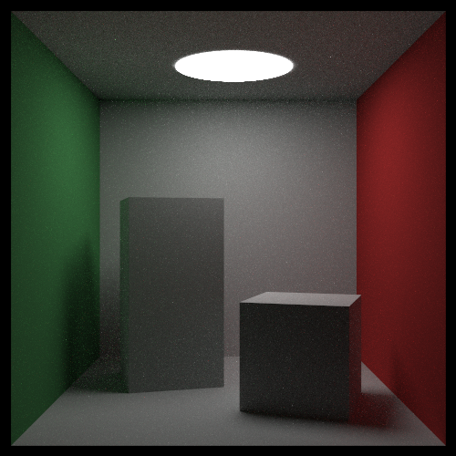
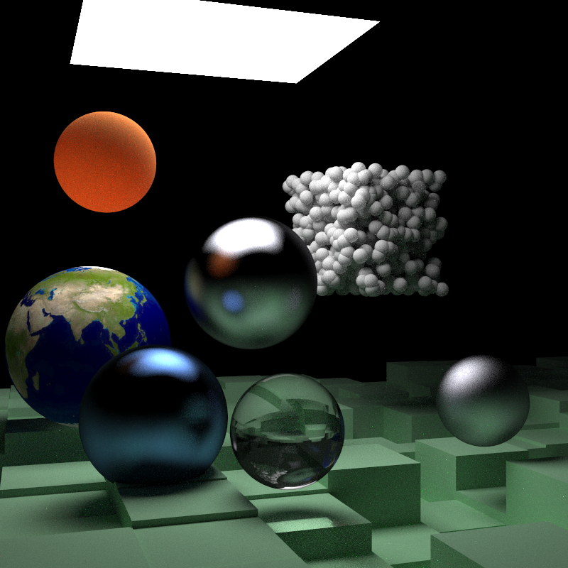

## Intro

Naive CPU Ray tracer implemented in Rust.

## Features

- multi-thread ray tracing
- loading `gltf` and `obj` models
- using Javascript to describe the scene
- supporting microfacet brdf

## Build

You can manually build or use Docker.

### Manually build

1. Install Rust toolchain

- see https://rustup.rs/

2. Compile the project

```sh
cargo build -p toy_ray_tracer --release
```

3. Running

```sh
mkdir -p output/cg
./target/release/toy_ray_tracer render --project-file=./assets/projects/cg/cornell_box.js -vvv
```

4. Output

The output image is located in [](output/cg/cornell_box.png)

### Docker

1. Run following command

```sh
docker buildx build . -t icstp-ray-tracer:v1
```

2. Run the image

```sh
mkdir -p output/cg
docker run -v $(shell pwd)/output:/app/output icstp-ray-tracer:v1 render -vvv --project-file=assets/projects/cg/cornell_box.js
```

## Usage

Example scene files are located in dir `assets/projects/cg/**`

### Render

Rendered images will be put into `output` dir

```sh
# -vvv to show the progress
mkdir -p output/cg
./target/release/toy_ray_tracer render --project-file=<scene-file> -vvv
```

## Demo

**[cornell_box](assets/projects/cg/cornell_box.js)**



**[rtw_scene2](assets/projects/cg/rtw_scene2.js)**



## Inspired By

Thanks to the following projects

- https://github.com/fralken/ray-tracing-the-next-week
- https://github.com/cbiffle/rtiow-rust
- https://github.com/Rabbid76/ray-tracing-with-rust.git
- https://github.com/Ubpa/ToyRTX
